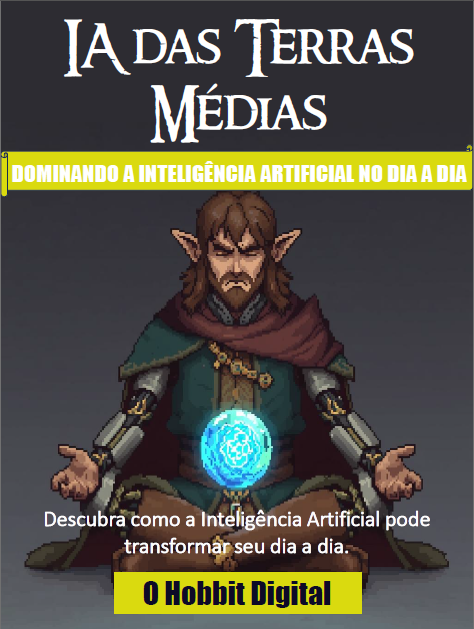

# O Hobbit Digital- Ebook

# Projeto Ebook Gerado por I.A.s

Projeto com o objetivo de gerar um ebook digital com as facilidades das ferramentas de IA.

<a href="https://github.com/thewandersondev/prompts-para-ebook-feito-com-IA/blob/1b49fbeac9741b7ccbd67fda43f0a185640a0421/output/Desafio%20Ebook%20-%20O%20Hobbit%20Digital.pdf" title="View PDF now"> 📕Clique aqui para ler</a>
## 💻 Tecnologias utilizadas no projeto

- [ChatGPT](https://chat.openai.com/) 
- [Leonardo AI](https://leonardo.ai/)
- [PowerPoint](https://www.microsoft.com/en/microsoft-365/powerpoint)

## ✨ Como foi feito ?

- Título e Conteúdo gerado via chatgpt
- Leonardo AI para gerar imagem
- PowerPoint para a montagem do ebook
